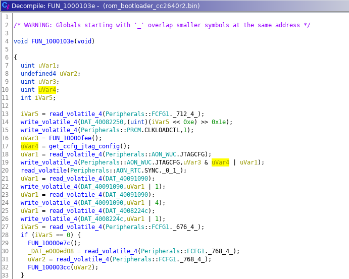

# Analysing the ROM bootloader in Ghidra

## Requirements
* [Download](https://github.com/NationalSecurityAgency/ghidra/releases) and [install](https://htmlpreview.github.io/?https://github.com/NationalSecurityAgency/ghidra/blob/Ghidra_10.1.1_build/GhidraDocs/InstallationGuide.html) Ghidra
  * Ghidra 10.1.1 is the latest version at time writing

* Add [SVD-Loader](https://github.com/leveldown-security/SVD-Loader-Ghidra) to your Ghidra scripts
* Download a suitable SVD file such as [CC26x0.svd](https://github.com/posborne/cmsis-svd/blob/master/data/TexasInstruments/CC26x0.svd).

## Loading the ROM bootloader

Open Ghidra, create a new project and add the extracted ROM bootloader (`rom_bootloader_cc2640r2.bin`) to the project.
A new window should pop up:

Make sure to select Cortex-M little endian as the language. 
Press `Options...` and set the base address to 0x10000000

Press `Ok` to complete loading the binary.
Open the ROM bootloader in the Ghidra CodeBrowser (double click the program in the project viewer). 

Ghidra will show a dialog box asking if you want to analyze the program, select `No`.
We want to update the memory map before running auto analysis. 
Open the memory map (Window --> Memory Map), and start by adding a block of SRAM memory starting at address 0x20000000 and 0x5000 bytes in size.
Also make sure to untick the write permission on the ROM bootloader that we loaded earlier.

Your memory map should now have ROM and SRAM memory regions:

We will use the [SVD-Loader](https://github.com/leveldown-security/SVD-Loader-Ghidra) script by [stacksmashing (@ghidraninja)](https://twitter.com/ghidraninja).
This script can parse SVD files to automatically create memory regions for the peripherals of our target microcontroller.
Open the Script Manager (Window --> Script Manager) and start the SVD-Loader script. The script will prompt you for an SVD file, select the [CC26x0.svd](https://github.com/posborne/cmsis-svd/blob/master/data/TexasInstruments/CC26x0.svd) file. Once SVD-Loader is finished your memory map should look something like this:

At this point we have loaded the ROM bootloader and added a lot of information to the memory map.
As a final step before starting auto analysis we are going to tell Ghidra that the first block of data are addresses (the [Interrupt Vector Table (IVT)](https://developer.arm.com/documentation/dui0552/a/the-cortex-m3-processor/exception-model/vector-table)).
Do this by selecting the start of the ROM in the Listing view and setting the data type to pointer (press `p` or right click --> Data --> pointer).

We can now follow the reset vector, to the code that is executed on reset. Do this by double clicking the `DAT_1000162b` pointer at address 0x10000004.
You will end up at address 0x1000162b, but Ghidra has not started disassembling the code here as we have not run auto analysis so far. Right click in the listing view at address 0x1000162b and select Disassemble (or simpy press `d`).

We know that the reset vector points to this address so after disassembly we can also create a function here by right clicking and selecting Create Function (or pressing `f`).
Your listing view should now look like this:

At this point we can start the Ghidra auto analysis (Analysis --> Auto Analyze), for now we can use the default options in the Analysis Options view and press Analyze.
At this point you can start doing some basic static analysis of the ROM bootloader.

## Getting started with static analysis

For the purpose of this example we are mainly interested in how the ROM bootloader enables and disables JTAG access.
From the documentation provided by Texas Instruments we know that a developer can disable the ROM bootloader serial interface and JTAG access by modifying the customer configuration (CCFG).
Specifically the CCFG:CCFG_TAP_DAP_0 and CCFG:CCFG_TAP_DAP_1 fields are used to disable specific JTAG TAPs and DAPs. Note that you have to write a specific value (0xC5) to enable the TAPs/DAPs and that any other value disables them. If you erase the flash memory these fields will be set to 0xC5, enabling all access.

Thanks to [SVD-Loader](https://github.com/leveldown-security/SVD-Loader-Ghidra) we have the CCFG memory region mapped and can easily find references to these fields.
You can do this by selecting the CCFG memory region in the Program Tree and looking for the CCFG_TAP_DAP_0 and CCFG_TAP_DAP_1 fields.

Looks like Ghidra identified one function (0x10000fa0) that references both of these fields! You can go to that function by double clicking the xref.
The following picture shows the decompiled code, which makes it easy to understand what this function does. The function is parsing the CCFG fields to determine which TAPs and DAPs are enabled (0xC5).
Note that this function creates a new value, that will have some of the lower 7 bits set depending on the CCFG fields.
You can rename this function to something recognisable (e.g. `get_ccfg_jtag_config`) by selecting the function name and pressing `l`.

So we know that this function creates a different representation of the CCFG:CCFG_TAP_DAP_0 and CCFG:CCFG_TAP_DAP_1 fields, but we don't know what this new representation or value is used for.
Similar to how we initially found this function we can now look for functions that reference `get_ccfg_jtag_config`. You can see references to this function in the Listing view or you can open the Function Call Trees window (Window --> Function Call Trees). In this way we find that the function at address 0x1000103e is using the `get_ccfg_jtag_config` function.

From the decompiled function at address 0x1000103e it is clear that the value returned by `get_ccfg_jtag_config` (stored in `uVar4`) is written to the AON_WUC:JTAGCFG register.
Those following along at home can dig into the function at 0x10000fee to figure out how `uVar3` is generated.

The least significant bits of the AON_WUC:JTAGCFG register are marked reserved in the documentation. From the above analysis we now know that setting these least significant bits enables the JTAG TAPs and DAPs!

We will later use this information to speed up initial fault injection attempts (see the notebook on [using VFI to re-enable JTAG](notebooks/4_glitch_rom_bootloader.ipynb)).
 
If you want to continue doing static analysis of the ROM bootloader I would suggest to search for references to the AON_WUC:JTAGCFG register or to look at 0x10000d70 to learn more about how the bootloader serial interface parses incoming commands.