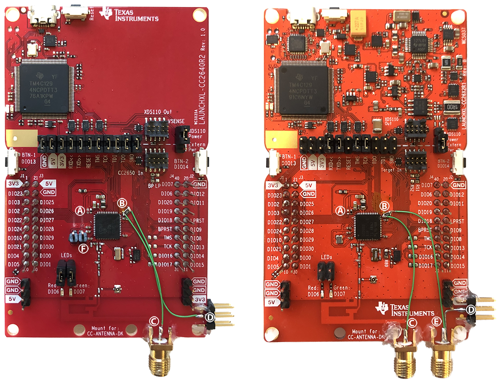

# Non-invasive physical attacks on SimpleLink microcontrollers
This repository contains artifacts for the paper titled 'On the susceptibility of Texas Instruments SimpleLink platform microcontrollers to non-invasive physical attacks'. Link to the full paper: [PLACEHOLDER](https://google.com)

In short, the paper covers:
* extracting the ROM bootloader of Texas Instruments SimpleLink microcontrollers
* static analysis of the ROM bootloader in [Ghidra](https://github.com/NationalSecurityAgency/ghidra) and emulating it using [Unicorn engine](https://github.com/unicorn-engine/unicorn)
* the use of Voltage Fault Injection (VFI) to re-enable JTAG access
  * using VFI to extract the firmware from a Tesla Model 3 key fob
* Side-Channel Analysis (SCA) and Differential Fault Analysis (DFA) of the AES hardware co-processor

The experiments covered in the paper were performed on the CC2640R2F and CC2652R1F microcontrollers, but the same techniques *should* apply to all SimpleLink microcontrollers in the CC13xx and CC26xx lineup. 
This repository provides information, firmware and Python Jupyter notebooks that can help to reproduce some of the results in the paper.

We reported all our findings to Texas Instruments well before publishing this repository. Texas Instruments does not claim resistance to physical attacks for these products and considers them out of scope. 
As a result of our reports Texas Instruments released a general [security advisory](https://www.ti.com/lit/an/swra739/swra739.pdf) to warn customers about the potential threat of physical attacks.

Note that the attack techniques used in this repository have been known for over 20 years, similar attacks can be (and have been) applied to microcontrollers from other manufacturers.

## Requirements

### Hardware
In this repository we will mainly focus on the CC2640R2F microcontroller, all experiments can be carried out using a [LAUNCHXL-CC2640R2](https://www.ti.com/tool/LAUNCHXL-CC2640R2) development board. As noted earlier, the same code can be used/extended to work with other boards from the CC13xx and CC26xx lineup.
The ROM bootloader extraction, analysis and emulation does not require any development board modifications, so you may want to do those parts before modifying your development board.

Texas Instruments provides [board design files](https://www.ti.com/tool/LAUNCHXL-CC2640R2#design-files), including the schematic and layout with reference designators. 
The target microcontrollers use an internal low-dropout regulator to generate the 1.28 V supply for the ARM Cortex-M CPU core. This internal core voltage rail is exposed on the DCOUPL pin to add an external decoupling capacitor. The availability of the internal CPU core voltage is convenient as we can momentarily short it to ground to try and inject glitches, and it allows us to capture power consumption traces for SCA.

The following picture shows LAUNCHXL-CC2640R2 (left) and LAUNCHXL-CC26x2R1 (right) development boards modified for side-channel analysis and voltage fault injection.
To perform voltage fault injection we remove C19 (connected to the DCOUPL pin) and C20 (connected to the reset pin), indicated by (B) and (A) respectively. We added an SMA connector (C) to the DCOUPL pin of the microcontroller. This SMA connector can be connected to a ChipWhisperer to inject glitches and to capture the voltage drop over the 10 Ohm shunt resistor inserted at (B). We supply 1.45V through connection (D) while acquiring side-channel measurements, this disables the internal regulator. SMA connector (E) is optional and allows for differential measurements. Finally, we removed the crystal oscillator on the LAUNCHXL-CC2640R2 (left), this allows us to supply our own clock for synchronous sampling, this modification is optional and is indicated by (F). The SMA connectors are grounded on the bottom side of the boards.

Note that removing C19 and C20, and adding a wire to the DCOUPL pin is sufficient if you only want to experiment with VFI.

We used the [NewAE](https://www.newae.com/) [ChipWhisperer Husky](https://www.crowdsupply.com/newae/chipwhisperer-husky) power-analysis and fault-injection tool as a platform to perform our experiments. All of the provided code assumes you are using a ChipWhisperer Husky, but the code can be easily modified to work with a ChipWhisperer-Lite instead. As shown in this great [video](https://www.youtube.com/watch?v=_E0PWQvW-14) it is likely possible to perform the same VFI attacks using even cheaper hardware.

### Software
To run all of the examples you will need Python3 and some additional packages.
Assuming you have Python3 installed you should be able to create a new virtual environment using the following instructions.

* Clone this repository: `git clone https://github.com/lwouters/simplepwn`
* Create a virtual environment: `cd simplepwn && python3 -m venv simple_venv`
* Activate the venv: `source ./simple_venv/bin/activate`
* update pip: `python -m pip install --upgrade pip`
* Install the required libraries: `python -m pip install -r requirements.txt`
  * Note that you may want to [install the ChipWhisperer software from source](https://chipwhisperer.readthedocs.io/en/latest/installing.html#install-repo-git) to get the latest version
* Start the Jupyter server: `cd notebooks && python -m jupyter notebook`

We use Texas Instruments' UniFlash to read and write firmware from/to the development kit. Some of the notebooks use the command line interface (dslite) to erase, program or read flash memory, so make sure you know the installation directory of uniflash.

* [Download](https://www.ti.com/tool/UNIFLASH#downloads) Texas Instruments' UniFlash and install it
  * On Linux: `chmod +x uniflash_sl.X.X.X.XXXX.run && ./uniflash_sl.X.X.X.XXXX.run` 
    * X.X.X.XXX will depend on the version you download, at the time of writing `7.0.0.3615` appears to be the latest version.
    * Note down the installation directory (default: `~/ti/uniflash_x.x.x` or in this case `~/ti/uniflash_7.0.0`)

* [Code Composer Studio](https://www.ti.com/tool/CCSTUDIO) (optional)
  * Makes it easy to modify/compile the target firmware

## Content

### The ROM bootloader
The ROM bootloader is a piece of code executed on startup before the main application starts. This bootloader is stored in ROM, cannot be changed and is the same for all CC2640R2F chips (assuming there is only one hardware revision). Getting access to this ROM bootloader and analysing it allows us to understand how JTAG is being enabled/disabled by the ROM bootloader. Additionally you can try to find undocumented functionality or try to identify software vulnerabilities.

As the ROM bootloader is the same for all CC2640R2F ICs we can try to dump it from a development board over which we have full control. Similarly, an attack targeting the ROM bootloader should work on all ICs with the same ROM bootloader (even if the attack was identified using a development board).

The following material will help you to extract the ROM bootloader from a CC2640R2F, will demonstrate how you can load and analyse the binary dump in Ghidra and how you can emulate the ROM bootloader using Unicorn engine.

1. [Extracting the ROM bootloader through the serial bootloader interface](notebooks/1_extract_rom_bootloader.ipynb)
    * We do not provide the ROM bootloader binaries, so you will have to use the provided example to dump it yourself.
2. [Loading the ROM bootloader in Ghidra](GHIDRA.md)
3. [Emulating the ROM bootloader using Unicorn engine](notebooks/2_bootrom_emulation.ipynb)

### Fault Injection
The ROM bootloader analysis (see Section 3 in the paper) revealed two potential avenues to bypass the debug security features using fault injection.
The first notebook shows how to glitch a simple dummy program to determine how susceptible our target is to voltage fault injection. The second notebook demonstrates the actual attack and allows to extract the firmware from a locked down microcontroller. A third bonus (EMFI was not originally covered in the paper) notebook was added demonstrating electromagnetic fault injection on a LAUNCHXL-CC26x2R1 using the [ChipSHOUTER PicoEMP](https://github.com/newaetech/chipshouter-picoemp).

1. [Determining a range for the glitch width parameter](notebooks/3_glitch_double_loop.ipynb)
2. [Using VFI to re-enable JTAG](notebooks/4_glitch_rom_bootloader.ipynb)
3. [BONUS: EMFI on the LAUNCHXL-CC26x2R1 using the ChipSHOUTER PicoEMP](notebooks/5_ChipSHOUTER-PicoEMP.ipynb)

### The AES hardware co-processor
The SimpleLink microcontrollers include a hardware implementation of the Advanced Encryption Standard (AES) cipher. The following notebooks can be used to recover the secret key used by this hardware implementation using Side-Channel Analysis (SCA) and Differential Fault Analysis (DFA). Note that we are conducting these attacks in a rather artificial scenario, the target microcontroller raises a GPIO pin while the AES operation is performed. This scenario is unlikely to occur in a realistic setting but it allows us to experiment with these techniques without having to apply more advanced techniques.

1. [Correlation Power Analysis](notebooks/6_SCA_HW_AES.ipynb)
2. [Differential Fault Analysis](notebooks/7_DFA_HW_AES.ipynb)
